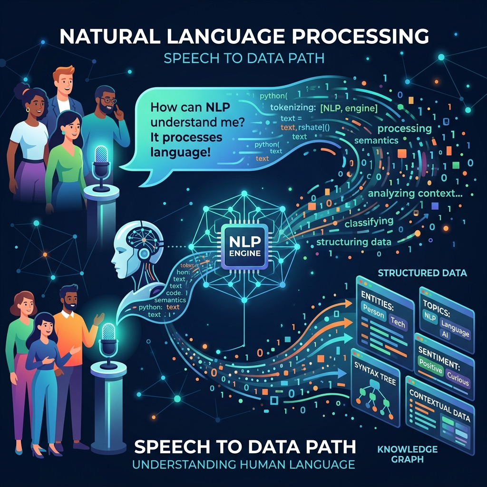

# 🤖 Artificial Intelligence Explained for Beginner Developers: A Complete Guide


Artificial Intelligence (AI) is everywhere today. Whether you're using GitHub Copilot, ChatGPT, Google Translate, or Netflix recommendations, you're interacting with AI.

But if you're new to software development, AI can seem overwhelming. Terms like *Machine Learning*, *Neural Networks*, *Large Language Models*, and *Deep Learning* are often used interchangeably, making it difficult to understand where to start.

This guide explains AI from a developer's perspective, without requiring a background in mathematics or data science.

---

# What is Artificial Intelligence?

Artificial Intelligence is the field of computer science focused on creating systems that can perform tasks that normally require human intelligence.

These tasks include:

* Understanding language
* Recognizing images
* Learning from data
* Making predictions
* Solving problems
* Generating text or code

Unlike traditional software that follows fixed rules, AI systems learn patterns from data and use those patterns to make decisions.

---

# Traditional Programming vs AI

Traditional software follows explicit instructions.

```text
Input + Rules → Output
```

For example:

```python
if temperature > 30:
    print("It's hot")
else:
    print("It's not hot")
```

AI works differently.

```text
Input + Data → AI Model → Prediction
```

Instead of manually writing every rule, we provide examples and allow the model to learn the patterns.

---

# Types of Artificial Intelligence

## 1. Narrow AI

This is the AI we use every day.

Examples include:

* ChatGPT
* GitHub Copilot
* Google Maps
* Netflix recommendations
* Face Unlock on smartphones

Each system performs one specialized task very well.

---

## 2. General AI

General AI would be capable of learning and performing any intellectual task a human can do.

This type of AI does not exist yet.

---

## 3. Super AI

Super AI refers to a hypothetical system that surpasses human intelligence in every field.

It remains a theoretical concept.

---

# Machine Learning: The Engine Behind Modern AI


Machine Learning (ML) is a branch of AI where computers learn from data instead of being explicitly programmed.

Imagine teaching a child to recognize cats.

Instead of writing thousands of rules describing a cat, you simply show many pictures labeled "cat" and "not cat."

Eventually, the child learns the pattern.

Machine Learning works in a similar way.

---

# Deep Learning

Deep Learning is a specialized area of Machine Learning that uses neural networks inspired by the human brain.

Deep learning powers:

* ChatGPT
* Image generation
* Speech recognition
* Self-driving cars
* Medical image analysis

Large Language Models (LLMs) are built using deep learning techniques.

---

# Natural Language Processing (NLP)



Natural Language Processing enables computers to understand human language.

Applications include:

* Chatbots
* Language translation
* Text summarization
* Sentiment analysis
* Voice assistants

If you've chatted with an AI assistant, you've already used NLP.

---

# Computer Vision


Computer Vision allows machines to understand images and videos.

Examples include:

* Face recognition
* QR code scanning
* Medical X-ray analysis
* Object detection
* Self-driving vehicles

---

# Real-World AI Applications

AI is already transforming many industries.

### Healthcare

* Disease diagnosis
* Medical image analysis
* Drug discovery

### Finance

* Fraud detection
* Credit scoring
* Algorithmic trading

### Education

* Personalized learning
* AI tutors
* Automatic grading

### Software Development


Developers use AI for:

* Code generation
* Debugging
* Documentation
* Test creation
* Code reviews

---

# A Simple Machine Learning Example

Suppose we want to predict house prices.

Our training data might look like this:

| House Size | Bedrooms | Price    |
| ---------- | -------- | -------- |
| 1000 sqft  | 2        | $120,000 |
| 1500 sqft  | 3        | $180,000 |
| 2200 sqft  | 4        | $300,000 |

A machine learning model studies these examples and learns relationships between the features and the price.

After training, it can estimate the value of houses it has never seen before.

---

# Why Every Developer Should Learn AI

You don't need to become a Machine Learning engineer.

However, understanding AI helps you:

* Build smarter applications
* Integrate AI APIs
* Automate repetitive work
* Increase productivity
* Stay competitive in the job market

Many modern applications now include AI features.

---

# Popular AI Tools for Developers

Here are some tools worth exploring:

| Tool           | Purpose                   |
| -------------- | ------------------------- |
| ChatGPT        | Learning, coding, writing |
| GitHub Copilot | AI coding assistant       |
| Claude         | Long-form reasoning       |
| Gemini         | Google's AI assistant     |
| Cursor         | AI-powered code editor    |

---

# Advantages of AI

AI offers many benefits.

* Automates repetitive tasks
* Improves productivity
* Processes large datasets quickly
* Assists with decision-making
* Enhances customer experiences
* Supports innovation across industries

---

# Challenges of AI

AI also comes with important challenges.

* Hallucinated or incorrect outputs
* Bias in training data
* Privacy concerns
* Security risks
* High computational costs
* Ethical questions around responsible use

Developers should always verify AI-generated results instead of accepting them blindly.

---

# A Quick Guide to Prompt Engineering

When I first started using AI, I just treated it like Google. But honestly, since most of us interact with AI through text, learning how to write *good* prompts is probably one of the highest-ROI skills you can pick up right now.

Here are three tricks that completely changed how I use AI:
1. **Be Specific:** Don't just say "Fix this bug." Give it the context of what you're trying to achieve, the error log, and the framework you're using.
2. **Assign a Persona:** Try starting your prompt with something like "Act as a senior Python developer..." It sounds silly, but it forces the model to use a more professional, expert tone.
3. **Format the Output:** If you need JSON, tell it exactly how the JSON should look. E.g., "Return the result as a JSON object with 'name' and 'id' keys."

---

# Calling an AI API is Actually Super Easy

A lot of devs think adding AI to an app requires a PhD. It really doesn't. To show you what I mean, here is a quick snippet of how you’d call the OpenAI API using Python. 

```python
import openai

response = openai.ChatCompletion.create(
  model="gpt-4",
  messages=[
        {"role": "system", "content": "You are a helpful assistant."},
        {"role": "user", "content": "Explain APIs to a 5-year-old."}
    ]
)

print(response['choices'][0]['message']['content'])
```

That's it! In less than 10 lines of code, you've just plugged a massive, state-of-the-art brain right into your application.

---

# Open-Source vs. Proprietary Models

If you're looking to build something with AI, you generally have two routes you can take:

1. **Proprietary APIs (Closed-Source):** Think OpenAI's GPT-4 or Google's Gemini. These are the heavy hitters. They’re crazy powerful and super easy to integrate via an API, but the trade-off is you pay per request, and your data is processed on their servers.
2. **Open-Source Models:** This includes models like Meta's Llama 3 or Mistral. The cool thing here is you can literally download them and run them locally on your own machine. They’re awesome if you're worried about privacy, want to avoid API costs, or just love having full control.

---

# The Buzzword Decoder

When you start reading AI docs, you're going to get hit with a wall of jargon. Here’s a quick cheat sheet for what these terms actually mean in plain English:

| Term | What it actually means |
| --- | --- |
| **Tokens** | It's how AI models count and chunk text. Think of a token as roughly 4 characters in English. It's how you get billed! |
| **Hallucination** | That annoying moment when an AI confidently lies to you and makes up incorrect information or fake code libraries. |
| **Inference** | Just a fancy word for the model doing its job: generating an answer or prediction based on your prompt. |
| **RAG** | Stands for "Retrieval-Augmented Generation." It’s a technique where you let the AI read your own private documents or codebase before it answers a question. |

---

# How to Start Learning AI

If you're beginning your AI journey, here's a simple roadmap:

1. Learn Python.
2. Understand basic statistics.
3. Study Machine Learning fundamentals.
4. Explore Neural Networks.
5. Build small AI projects.
6. Learn how to use AI APIs.
7. Practice by solving real-world problems.

Consistency matters more than speed.

---

# Final Thoughts

Artificial Intelligence is no longer a futuristic concept. it's becoming a standard part of modern software development.

As developers, we don't all need to build our own AI models, but we should understand how AI works, when to use it, and its limitations. Whether you're integrating an AI API, using an AI coding assistant, or building intelligent applications, a solid foundation in AI will help you adapt to the future of software engineering.

The best way to learn AI isn't just by reading about it. It's by experimenting, building projects, and staying curious.

Happy coding! 🚀

---

**What was the first AI tool that genuinely improved your workflow as a developer? Share it in the comments. I’d love to hear your experience.**
